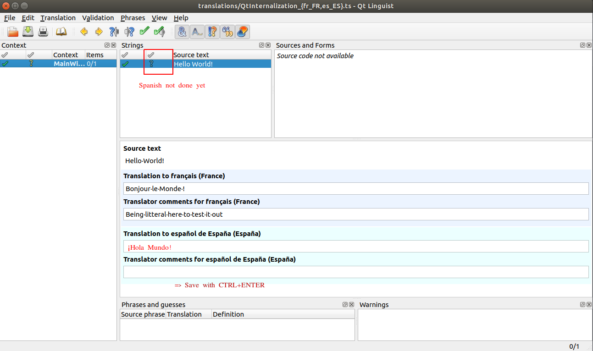

# A Simple project to demonstrate how Internationalization works in Qt (with CMake)

I created a simple QLabel with a `tr` (instead of a plain `QString`)


I then used Qt Linguist to translate the ts file: very easy! The hardest part was how to launch qt linguist. I expected Qt Creator to propose it, but couldn't find that.
I located the tool at `~/Qt/6.0.3/gcc_64/bin/linguist` (using `find` command).


Then modified [main.cpp](main.cpp) to install a translator, and voilà !


## Adding another translation

I'm going to show how to do add translation for Spanish for example:

1. Register a new translation file in `CMakeLists.txt`

```diff
set(TS_FILES
  translations/QtInternationalization_fr_FR.ts
+ translations/QtInternationalization_es_ES.ts
)
```

Now build again. That file will be created.

**Note:** this is **better** than actually copying the French one because that way Qt `linguist` will show you in the UI what you haven't translated yet.

2. Open qt `linguist`. You can load **both** translation files at the same time to get more context. Add your translation, save with <kbd>Ctrl</kbd> + <kbd>Enter</kbd>



You can see [PR#2](https://github.com/jmarrec/QtInternationalization/pull/2) for the actual code changes I did.

## Testing it out

After building, you can launch the executable by passing `LANG=` env variable

```
# Default to your current locale, english in my case
./QtInternationalization
LANG=fr_CA.UTF-8 ./QtInternationalization
LANG=fr_FR.UTF-8 ./QtInternationalization
LANG=es_ES.UTF-8 ./QtInternationalization
```
