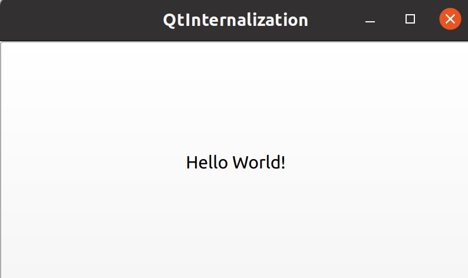
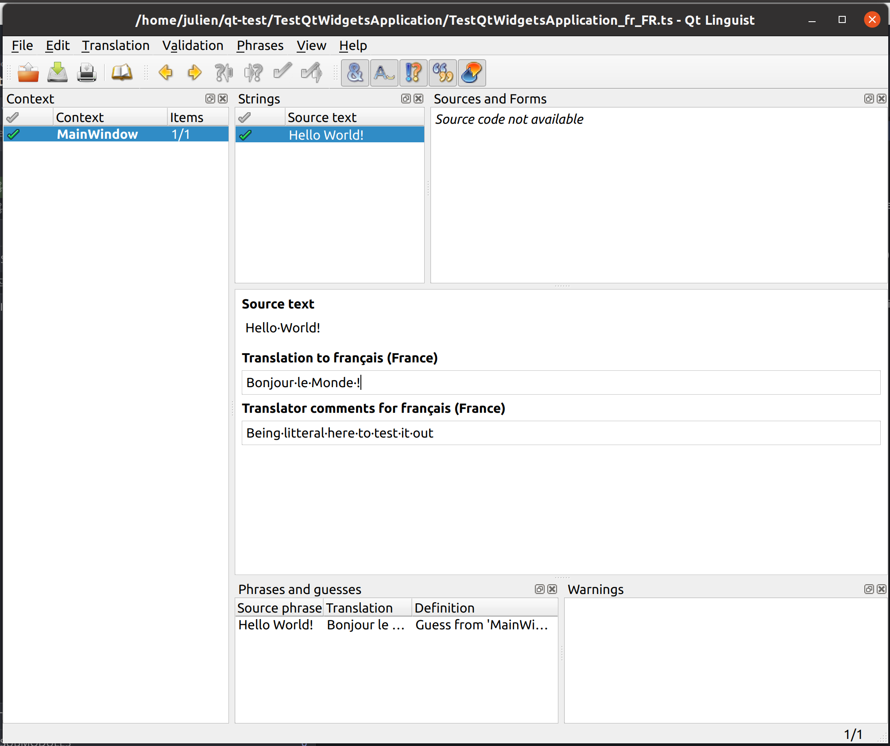
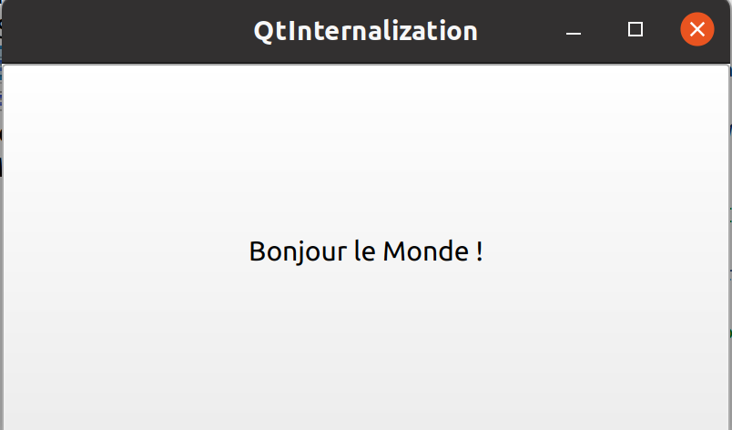

# A Simple project to demonstrate how Internalization works in Qt (with CMake)

I created a simple QLabel with a `tr` (instead of a plain `QString`)

I then used Qt Linguist to translate the ts file: very easy! The hardest part was how to launch qt linguist. I expected Qt Creator to propose it, but couldn't find that.
I located the tool at `~/Qt/6.0.3/gcc_64/bin/linguist` (using `find` command).

Then modified [main.cpp](main.cpp) to install a translator, and voilà !

